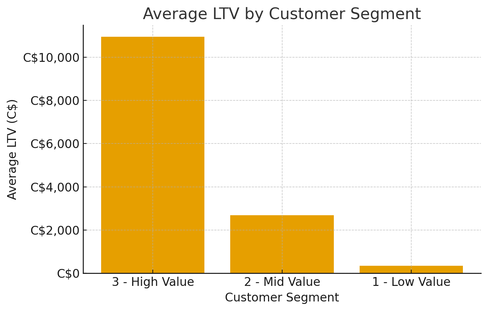
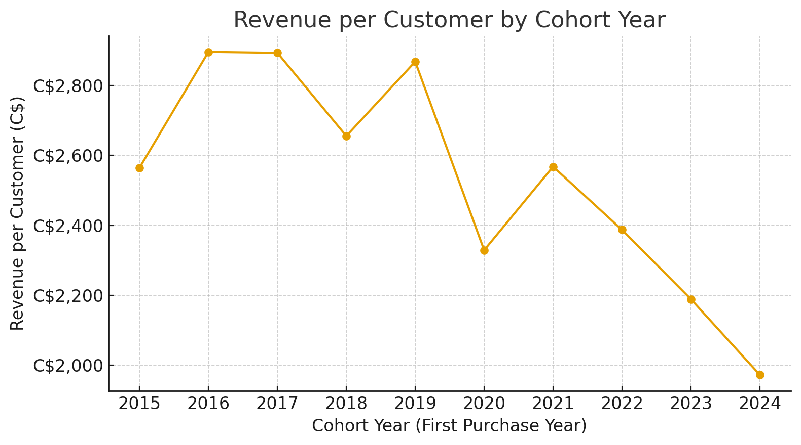
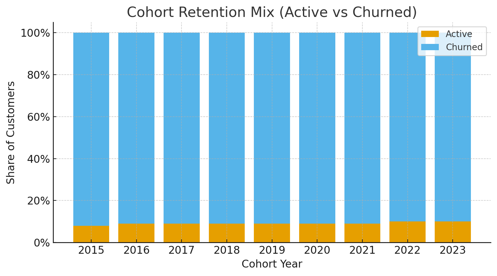

# Customer Analytics

This project dissects fictitious company sales and customer data using SQL queries and visualizations. 
 
The goal is to understand customer value, cohort dynamics, and churn/retention patterns that drive long-term revenue.

---

## 📊 Query 1 — Customer Lifetime Value (LTV)

**Goal:** To understand who our **low, mid,** and **high value customers** are based on spending, and determine their consumer LTV.

**Process:**  
1. Customers were grouped into 1 of 3 segments based on spending percentiles:  
- **High Value**: ≥ 75th percentile  
- **Mid Value**: 25th–75th percentile  
- **Low Value**: ≤ 25th percentile

2. We aggreated the segments to calculate how much they spent on average over all of their unique purchases.

**Insight:**  
High-value customers spend dramatically more on average compared to mid and low-value customers. This shows where most of the company’s lifetime value comes from.

 

**SQL:** See [`SQL Query #1`](./Queries/1_customer_segmentation.sql)  

---

## 📈 Query 2 — Cohort Analysis

**Goal:** To group customers by **Cohort Year** (first purchase year) to determine what percentage of customers are new every year.

**Process:**  
1. Customers were aggregated by their year of first purchase.
2. **Customer growth** and **Revenue Per Customer** were calculated and compared in each year.

**Insight:**  
While the company is acquiring more customers each year, the **revenue per customer is slowly declining**. This suggests we are losing pre-existing customers faster and missing out on maximizing lifetime value.

 

**SQL:** See [`SQL Query #2`](./Queries/2_cohort_analysis.sql)  

---

## 🔄 Query 3 — Churn & Retention

**Goal:** To determine which percentage of our customers are **Churned** (havent purchased in last 6 months) and which percentage are **Active** (have purchased in last 6 months).

**Process:**  
1. Each customer's last purchse date was queried. 
2. Classified as **Active** or **Churned** based on whether they purchased in the last 6 months relative to the dataset’s snapshot date.  

**Insight:**  
The majority of customers are **Churned**, highlighting missed opportunities to **re-monetize existing customers**. This points toward strategies like re-engagement campaigns, loyalty programs, or personalized marketing to lift retention.

 

**SQL:** See [`SQL Query #3`](./Queries/3_retension_analysis.sql) 

---

## 🛠 Tech Stack
- **SQL**: Views & CTE's to define complex queries  
- **ChatGPT**: Generating visualizations 
- **GitHub**: Project hosting & organizaiton

---

## 🚀 What I learned:
- 
